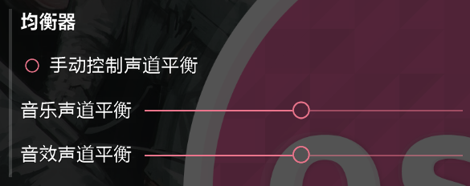

#客户端特殊功能

本客户端是一个特殊的Osu!客户端，在保证了Osu!的基本功能的同时，还提供了一些特殊的功能。

~~PPY做的功能都是什么垃圾，让我们有游玩经验的玩家来设计~~

##多模式通用功能

###回放进度条

我们为replay的回放增加了一个进度条，可以让玩家轻松的跟踪游戏进度，为你的生命+1s。

如图所示，点击进度条可以跳转到指定的时间点。

注意

此功能仅供回放参考

stable设计之初不曾想过这东西未来某一天还能用进度条拉，我们很难实现分数，combo，acc等数据在进度变化的时候保持精确（replay是线性单向的）

同理，跳转至某些切入点会触发notelock，导致replay里串一个都打不着，滑条断尾，转盘消失等奇怪现象，re一下即可。

###很多的三角形

在切换的时候加入大量的三角形来过场，让玩家看起来更加舒服。

预览效果如图所示

###选歌界面相关功能

`显示可获得的最大PP` 选项可以在选歌界面中加入当前谱面的可获得最大PP(表现为下图跟在星数后的pp)

与服务器算法有些许不同，仅供参考

`仅显示当前选择的模式的谱面` 选项可以将非当前选择模式的谱面全部去除，省去了手敲mode的麻烦

###常规选项卡相关功能

`背景暗化时长` 选项可以调整进入谱面后背景由100%亮度变暗所需的时间

`打击偏差信息` 可以在打击偏差条上显示具体的偏差时间

如图所示

对于这四个选项,有以下解释

禁用：禁用提示

相对于点击：点击的时间与note的时间之差

相对于Note：Note的时间与点击的时间之差

Unstable Rate：[官方维基有关Unstable Rate的说明](https://osu.ppy.sh/wiki/Unstable_Rate)

`显示实时PP` 选项可以在游戏界面显示目前获得的PP值（与服务端不一致，仅供参考）

开启之后效果如图所示(蓝色字体即为当前获得pp)

`SuddenDeath自动Retry` 为SD提供了一个类似于Perfect自动重试的功能，选中后SD打图miss会自动重试

`自动跳过前奏` 自动点击进入铺面的Skip

`NoFail Mod 提醒` 选中后当你带着NF进行游玩时会收到提醒，防止忘记关闭NF

`禁用Eazy Mod复活暂停` 选中之后EZ死亡不会暂停，而是无缝衔接

`Qualified与Loved地图的提示持续时间` 调整烦人的大黄条持续时间

`多人游戏失败时的提示` 有三个选项，分别是默认、只提醒一次和不提醒

可以让你在MP死亡时调整死亡提示的出现次数，不会那么烦人

###OSU选项卡相关功能

`osu按键音效` 可以让你在游玩过程中空按键盘也有key音

`osu滑条尾音效` 同上，为某些特殊人群定制

`击中缩放特效大小倍率` 调整note击中时的扩散大小

`击中缩放特效时间倍率` 调整note击中时的扩散时间

`缩圈缩放倍率` 调整缩圈进入时离note的远近

`缩圈淡入` 调整缩圈淡入的时间

`Note淡入` 调整Note淡入的时间

`缩圈淡入最终深度` 调整缩圈淡入是从多少透明度开始的

###Relax选项卡相关功能

`Relax时显示Miss标记` 将miss加入到relax的游戏当中

`Relax Mod允许Fail` 当血条清空时Relax会fail

`Relax时显示边框` 在relax游玩时显示combo、分数等信息

`Relax时保存成绩到本地` Relax游玩后自动保存成绩到本地，免去F2的麻烦

###均衡器选项卡相关功能

可以控制音乐和音效的左右平衡，通过录音可以对比频谱进行准确调整offset

###皮肤选项卡相关功能

多模式皮肤可以分开选择，省去了多模式玩家的换皮肤操作

`重新载入当前皮肤` 在更改了当前皮肤之后，可以按这个按钮进行更新

`重新载入皮肤列表` 在skin文件夹加入新皮肤后，可以按这个按钮进行更新

`光标尾高级设置` 与 `光标尾缩放` 可以让光标尾发生一些特殊的变化，详见[差异的视频](https://www.bilibili.com/video/BV1XP4y1a7Db)

`绘制300(s)` 与 `绘制Star2` 和 `绘制光标拖尾` 提供了这些元件的绘制开关，在性能弱的电脑上关闭这些选项可以增强游戏表现

`绘制100 Early/Late 代替原有的100s` 可以将原来的100替换成Early/Late，效果如图

`绘制50 Early/Late 代替原有的50` 同理

如果想要自定义Early/Late的图片，可以在皮肤中绘制一个和100/50相同规格的图片

文件名为

| 早了                | 晚了               |
|-------------------|------------------|
| hit100-early.png  | hit100-late.png  |
| hit100k-early.png | hit100k-late.png |
| hit50-early.png | hit50-late.png |

同时，你可以加上-0 -1 -2 -3 -4... 后缀来自定义帧数（和原来的hit100、50一样）

###直播选项卡相关功能

可以连接至 [哔哩哔哩直播间](https://live.bilibili.com/3470615) ，会创建一个#Live频道，接收房间的弹幕

注：暂时只支持Bilibili，且只能接收弹幕。未来会有更多关于直播的功能(饼)

#亚托利选项卡相关功能

请打开