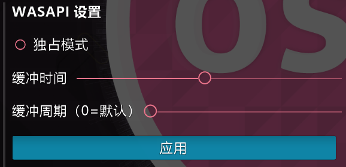
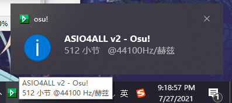
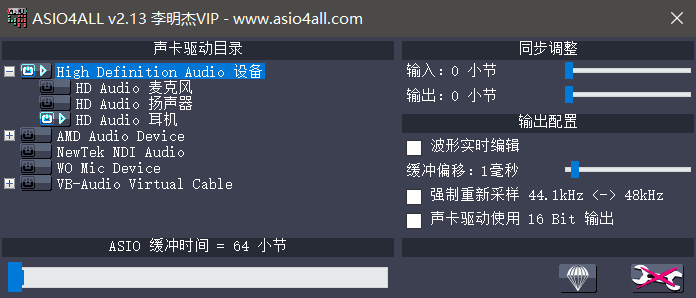
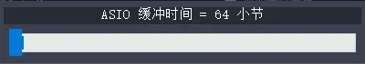

# 音频

## 游戏内音频设置

在ATRIAS客户端里，我们支持三种输出方式：DirectSound, WASAPI, ASIO。

这三种不同的输出方式是本服的特色功能之一，它是为了提供更低的延迟和更好的音质而设计的。

一般来说，他们三个的延迟排行是：DirectSound > WASAPI(独占模式) > ASIO。

我们推荐想要没有专业声卡但仍然想尝试低延迟的玩家使用ASIO4ALL进行体验，它的稳定性比WASAPI独占更高，体验也更好。

虽然开启独占模式可以获得更低的延迟和更好的音质，不过会导致其他应用无法发出声音，Osu本身也无法直接被其他应用采集。

降低缓冲时间和缓冲周期可以进一步降低音频延迟，经过多次测试,
**缓冲时间1ms 缓冲周期3ms**
是大部分电脑自带的小螃蟹声卡的最优设置。

尽量不要设置低于这个值，否则可能会出现破音。

如果此设置仍然出现不正常现象，试着将缓冲周期设置为0（自动）并慢慢往上调缓冲时间。

~~别忘记每次更改都要点应用~~

## 关于ASIO4ALL

一般只有专业的录音用声卡支持原生ASIO，如果你的声卡原生支持ASIO，你可以直接在音频设备里看到它，选择之后也可以直接跳过这个部分了，注意本客户端的**asio buffer不能小于32**。

ASIO4ALL是一个板载声卡模拟ASIO输出的小工具，它的原理是通过绕过windows音频驱动，来减少对音源的多重处理，提高响应速度。

您可以从 [ASIO4ALL官网](https://asio4all.com/) 下载它，也可以从 群共享->工具 内下载安装包。

下载好之后安装，安装完成后不需要做什么，把游戏设置输出为ASIO4ALL V2。

此时任务栏会出现ASIO4ALL的图标，单击图标可以打开界面。

浅蓝色图标表示了ASIO4ALL当前使用的音频设备，单击图标可以开启或关闭。

缓冲时间默认设置了512小节，建议调小到64，这样可以降低延迟。 

缓冲偏移默认值设置是4毫秒，建议调小到1毫秒，进一步降低延迟。

修改设置后最好重启一下osu，确保设置生效。

注意事项：

WASAPI独占模式和ASIO模式下的音效和音乐会无损叠加，这样会使音效更加清晰

因此有些皮肤的音效可能会听起来 **非常响** ，请注意降低音量保护耳朵