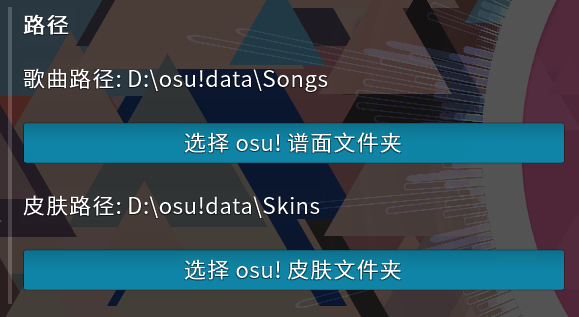

# 开始Atrias之旅

在开始之前，我们默认您已经拥有了对于 osu! 的**基础认识**

## 下载客户端

由于本服的特殊性，不能使用您一直以来游玩的bancho官方客户端登录

目前只有一种方式可以获得客户端本体，即加入我们的[QQ群](https://jq.qq.com/?_wv=1027&k=v5kNlF0G)

群文件客户端文件夹内通常会有三个文件

```bash
群文件
│   
└───群在线文档
│   │   ...
│   
└───客户端
|   │   ATRIAS_YYYYMMDD.zip                                |主体压缩包
|   │   osu!.exe                                           |补丁文件
|   |   如果该文件夹内有osu!.exe，请将其覆盖掉原有osu!.exe    |提示
│   
└───Skin
|   │   ...
│   
└───工具
    │   ...
```

您需要下载主体压缩包，解压后再使用补丁 **osu!.exe** 对原有 **osu!.exe** 主程序进行替换

## 配置文件迁移

首先您需要找到官服osu文件夹下的数个文件

```bash
osu!
└───Chat
└───Data
└───Downloads
└───Exports
└───Localisation
└───Logs
└───Replays
└───Screenshots
└───Skins
└───Songs
|   ...
|────────────────────────────────┐ 复制这六个文件到Atrias客户端文件夹内
| osu!.<computer name>.cfg       │
| osu!.cfg                       │
| collection.db                  │ 
| osu!.db                        │
| presence.db                    │
| scores.db                      │    
├────────────────────────────────┘
|   ...
|   ...
```

为保证一致的配置以及避免谱面难度重新计算造成的卡顿。推荐将上方方框内的六个文件一并移动到Atrias客户端文件夹内

## 设置 Songs/Skins 文件夹

进入设置，找到路径选项一栏



在进入选歌界面之前请务必先设置好 Songs 文件夹

这两个选项使得您无须移动巨量的谱面和皮肤文件

## 小结

至此，osu!Atrias 客户端已经准备就绪，开始游玩吧！

服务器的其他介绍以及问题解答请参考左边导航栏内的内容
